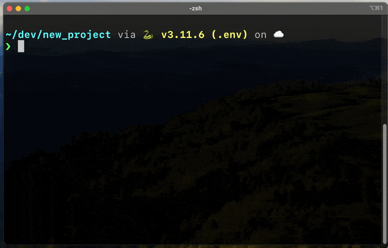

# Scaffold

A simple project scaffold builder for Python projects.



The project takes an input JSON file that specifies the folders and files to create. Files can optionally be populated with lines in the JSON file:

```json
{
    "folders":[
            "./docs",
            "./tests",
            "./src"
        ]
    ,
    "files": {
        "./README.md": [
            "# README"
        ],
        "./LICENSE": [],
        "./requirements.txt": [],
        "./.gitignore": [
            ".DS_Store",
            "out",
            "log.log",
            "__pycache__"
        ]
    }
}
```

## Installation

```bash
pip install git+https://github.com/jeffgolden/scaffold
```
